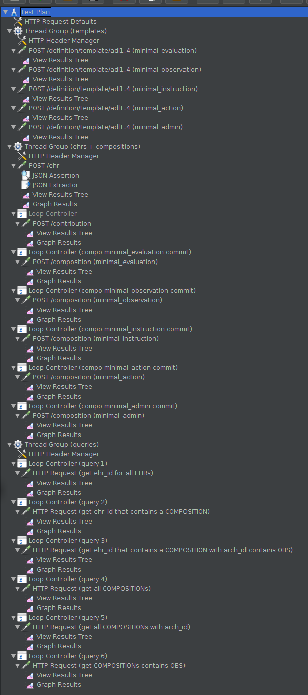

# Using the JMeter Script

1. Download and extract JMeter

  https://jmeter.apache.org/download_jmeter.cgi

2. Execute the GUI

    ```
    $ cd jmeter/bin
    $ ./jmeter
    ```

3. Load the JMeter Script
  1. File > Open (CTRL + O)
  2. Locate the "jmeter/HTTP Request.jmx" file contained on this repo
  3. Open that file
  4. The Test Plan will be loaded

  

4. Test Plan description

  1. The Test Plan item has general configuration about how the tests will run, for instance if the Thread Groups will run in parallel or sequential.
  2. The HTTP Request Defaults has some values that will be used by all HTTP Requests, like Server IP, Port Number, and Content Encoding.
  3. Each Thread Group defines how to execute the HTTP Requests.
    1. Number of Threads: is used to know how many parallel "users" will be simulated.
    2. Loop Count: defines how many actions each "user" will do.
  4. Inside Thread Groups, the first item is the HTTP Header Manager, that allows to define the Request Headers that will be used by the following HTTP Requests. Generally we use three headers: Content-Type, Prefer and Accept, but this depends on the specific REST service that will be invoked.
  5. On Thread Group 1, we have the HTTP Requests as direct children, since those are used to upload the OPTs that will be referenced from the COMPOSITION commits (mentioned below).
    1. The HTTP Request item needs to specify the Method and Path (the rest of the parameters are taken from the HTTP Request Defaults item)
    2. Inside each HTTP Request we have Listener items, those are used to display results from the executed HTTP Requests.
  6. On Thread Group 2, we have requests to create EHRs and commit COMPOSITIONs.
    1. Multiplying Number of Threads by Loop Count, that will determine the total number of EHRs that will be created.
    2. It contains a HTTP Header Manager item where the headers for the following HTTP Requests are configured.
    3. The HTTP Request to POST /ehr creates one EHR, needs to Method and Path to be set, the rest are configured by the HTTP Request Defaults and the HTTP Header Manager.
    4. Inside the HTTP Request to /ehr we have a JSON Assertion, used to check the format of the ehr_id, using a JSON Path to extract the value and a regex to check the value.
    5. Then we have a JSON Extractor, that will extract a value from the JSON Path $.ehr_id.value and set the ehr_id variable, available for any step that comes after.
    6. The View Results Tree Listener is included to see the details of each individual request to POST /ehr
    7. And the Graph Results Listener is included to see the response times as a chart.
  7. After the POST /ehr HTTP Request we have Loop Controller items, each represents a number of requests to commit COMPOSITIONS on POST /composition, the Loop Count is used to specify how many executions of the internal HTTP Request will be executed, this allows to execute many POST /composition for each POST /ehr, since POST /composition needs the ehr_id extracted from the each EHR created.
  8. Inside each Loop Controller item, we have a POST /composition HTTP Request item, that needs the Method, Path and Body Data. The rest of the configuration is taken from the HTTP Request Defaults and the HTTP Header Manager.
  9. Inside each POST /composition HTTP Request, we have a View Results Tree item (to see the response of each individual request) and a Graph Results item (that charts the response times of the requests).
  10. On Thread Group 3, we have requests to POST /query/aql, to execute ad-hoc queries.
    1. Contains a HTTP Header Manager with the Request Header configuration for all the HTTP Requests in the Thread Group.
    2. Each Loop Controller item simulate many requests to each query execution.
    3. The HTTP Request items execute one query, each query example was taken from the tests designed for Conformance Testing.
    4. Inside each POST /query/aql HTTP Request, we have a View Results Tree item (to see the response of each individual request) and a Graph Results item (that charts the response times of the requests).

5. Test execution from the GUI (only for testing the definitions, not to run the full load tests!)

  1. Just click on the Play icon to run the tests.
  2. If you select a listener (View Results Tree or Graph Results), you will see the results as they are coming.
  3. To clean the results, right click on the listener and select "Clear".

6. Test execution (from the Terminal)

  1. JMeter should be initialized in non-gui mode.
  2. $ jmeter/bin/jmeter -n -t HTTP\ Request.jmx -l testresults.jtl
  3. -n: non GUI mode
  4. -t: test plan to execute
  5. -l: output file with results
